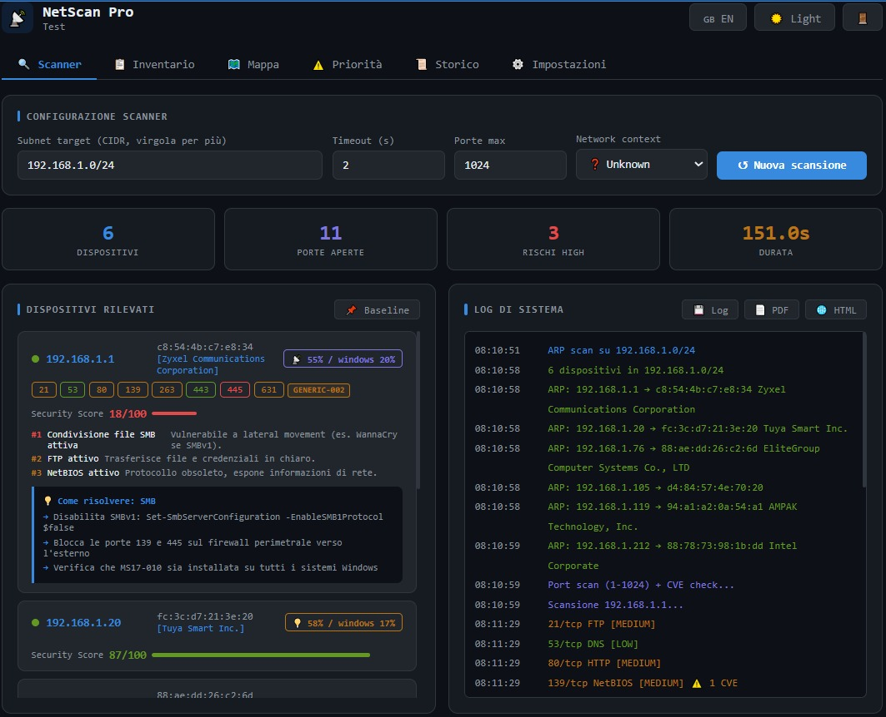
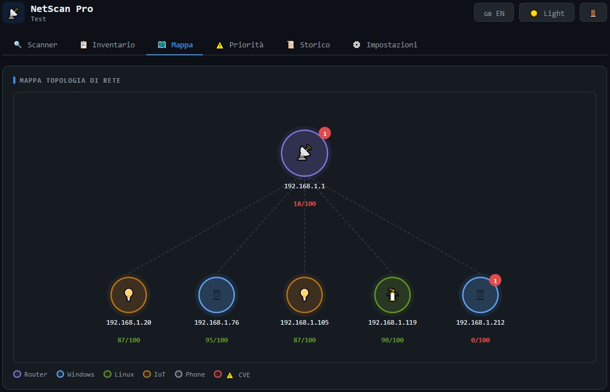
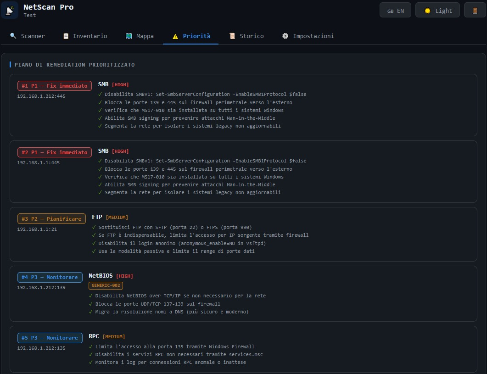

markdown# 📡 NetScan Pro SMB
**Local network security assessment for small businesses — no IT department required.**

> Scans your LAN, identifies every device, detects known CVE vulnerabilities,
> and generates a PDF report readable by a business owner or insurance broker.
> Not a replacement for a professional pentest. A starting point for businesses
> that currently have nothing.

---

## Who it's for
- SMBs with no internal IT department
- IT consultants managing small business networks
- Companies preparing for NIS2 compliance documentation
- Business owners who need a cyber insurance readiness report

**Not designed for**: enterprise environments, certified audits, 
active exploitation testing, or replacing Nessus/OpenVAS.

---

## How it works
LAN Scan (ARP)

↓

Device Discovery + Vendor Detection (MAC OUI database)

↓

Port Scan + Service Fingerprinting

↓

CVE Correlation Layer (NVD-based, updated periodically)

↓

Risk Scoring (per device + network overall)

↓

NIS2 Gap Analysis (rule-based mapping, not a certified audit)

↓

PDF Report Generator (executive + technical sections)

---

## What it actually detects

- Open ports and exposed services (SMB, FTP, RDP, SSH, HTTP/S, SNMP, DNS)
- Known vulnerable service patterns mapped to CVE identifiers
- Weak configurations (SMBv1, unencrypted FTP, open DNS resolvers)
- Device roles (router, PC, IoT, printer) with confidence score
- NIS2 control gaps (inventory, encryption, patch management, segmentation)

---

## Known limitations (read before using)

- **CVE matching is heuristic**, not version-confirmed.
  If a service is detected on a port, it is mapped to known CVEs for that 
  service type. The actual software version is not always fingerprinted.
  False positives are possible, especially on devices with HTTP Basic Auth
  (all paths return 401 regardless of existence).

- **NIS2 output is a gap analysis**, not a certified compliance assessment.
  It maps scan findings to NIS2 control categories. It does not replace
  a formal audit or legal assessment.

- **Does not perform active exploitation.**
  Active tests (SMB null session, SNMP community check, HTTP default credentials)
  require explicit user consent and are clearly labeled in the report.

- **Service fingerprinting may be inaccurate on NAT networks or IoT devices**
  with non-standard HTTP implementations.

- **Windows only** (10/11 64-bit). Requires Administrator privileges.

---

## CVE Database

- Source: NVD (National Vulnerability Database) + curated ruleset
- Covers: EternalBlue (MS17-010), BlueKeep (CVE-2019-0708), 
  OpenSSH RCE, Log4Shell indicators, and ~50 additional patterns
- Update frequency: bundled with software updates (currently manual,
  automatic update planned for v1.2.0)

---

## Real scan output

**Sample network scan (8 devices, home office environment):**

- Overall score: 59/100 — Grade D
- Devices found: 8
- Open ports: 10
- HIGH risks: 3 (SMB active on 2 devices, open DNS resolver)
- CVEs flagged: 3
- NIS2 compliance: 7/10 controls met

**PDF report includes:**
- Executive summary (non-technical, for business owner)
- Per-device risk breakdown
- Prioritized remediation plan (max 10 items, ranked P1→P4)
- NIS2 gap analysis table
- Economic risk estimate (based on Clusit 2025 Italian SMB data)
- Cyber insurance readiness checklist (5 insurer-required controls)
- GDPR Art.32 violation mapping

📄 [Download sample report PDF](link-to-sample)  
🖼️ Screenshots below

---

## Features v1.1.0

- Device discovery via ARP with vendor detection (MAC OUI)
- Device role identification with confidence score
- Port scan + service fingerprinting
- CVE correlation (NVD-based heuristic mapping)
- Security Score per device + A-F rating
- NIS2 / ACN 379907-2025 gap analysis (automated, rule-based)
- PDF report: executive section + technical detail + remediation
- Interactive network topology map
- Baseline comparison between scans
- Asset inventory with aliases and CSV export
- Scheduled weekly scans with email alerts
- White-label: custom company logo on PDF
- Active tests (with explicit consent): SMB, HTTP, SNMP, FTP, DNS
- Bilingual interface (Italian / English)

---

## Installation

1. Download the installer from [Gumroad](https://netscanpro.gumroad.com/l/ijasr)
   (free version available, no account required)
2. Run `NetScanProSMB-Setup.exe` as Administrator
3. Complete setup with one-time token
4. Launch and scan — first results in under 5 minutes

No external dependencies. No cloud connection required.
Everything runs locally on your machine.

---

## Pricing

| Product | Price | Link |
|---|---|---|
| Free version | Up to 10 devices | [Download](https://netscanpro.gumroad.com/l/ijasr) |
| Single license | €49 one-time | [Buy](https://netscanpro.gumroad.com/l/ijasr) |
| Subscription | €19/month · €149/year | [Subscribe](https://netscanpro.gumroad.com/l/ktsxb) |

Each paid license includes 1 installation, all updates, and email support.

---

## Screenshots

---

## Links

- Website: https://tiamat19.github.io/NetScan-Pro-SMB/
- Purchase: https://netscanpro.gumroad.com/l/ijasr
- Support: tiamat19807@gmail.com

---

## Developer

Mattia Cedone — 19 y/o software developer, Turin, Italy.  
Built to solve a real problem: Italian SMBs have no simple, affordable tool 
to understand their network security posture before an incident happens.

---
