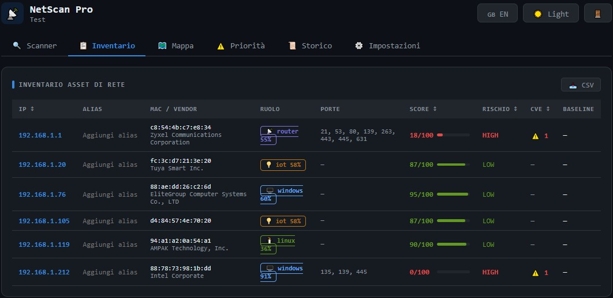
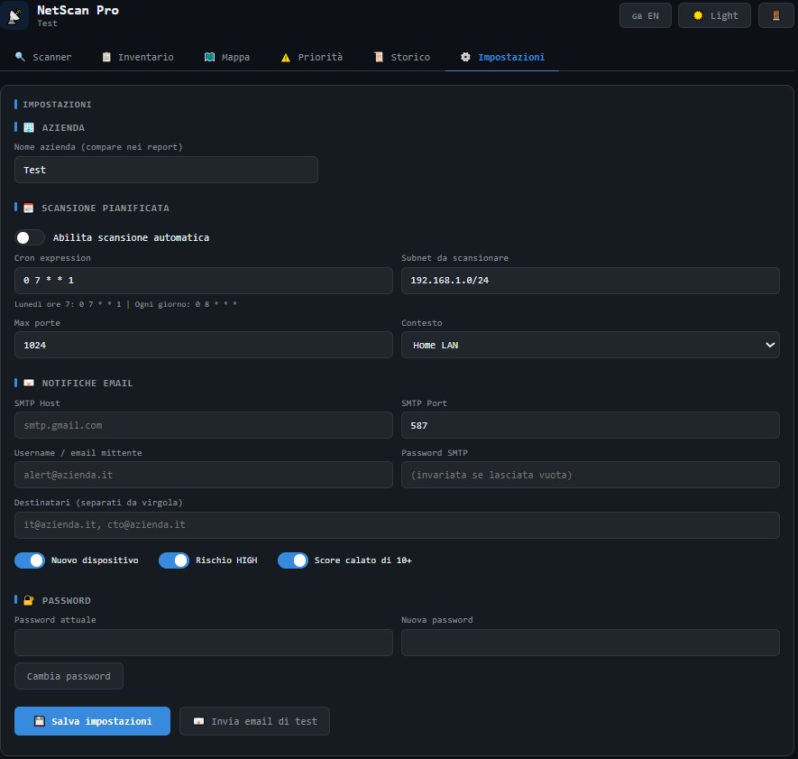

# 📡 NetScan Pro

**Cybersecurity Assessment Tool per reti locali — per consulenti IT e PMI.**

Scansiona la rete, identifica ogni dispositivo, rileva vulnerabilità CVE note
e genera report PDF professionali in 5 minuti.

---

## Funzionalità

- 🔍 Discovery dispositivi via ARP con rilevamento vendor
- 🧠 Identificazione ruolo dispositivo con score di confidenza
- ⚠️ CVE Database integrato (EternalBlue, BlueKeep, OpenSSH RCE...)
- 📊 Security Score per dispositivo e rete
- 📄 Report PDF professionale con piano di remediation
- 📅 Scansioni automatiche settimanali con alert email
- 🗺️ Mappa topologia di rete interattiva
- 📌 Baseline — confronto con stato precedente
- 📋 Inventario asset con alias e export CSV
- 🔐 Autenticazione con token di setup monouso
- 🇮🇹 / 🇬🇧 Interfaccia bilingue

---

## Screenshot

---

## Acquisto e licenza

🛒 **[Acquista su Gumroad](https://netscanpro.gumroad.com/l/ijasr) — €49**

Ogni licenza include:
- 1 installazione (Windows o Linux)
- Aggiornamenti inclusi
- Supporto via email

---

## Supporto

tiamat19807@gmail.com